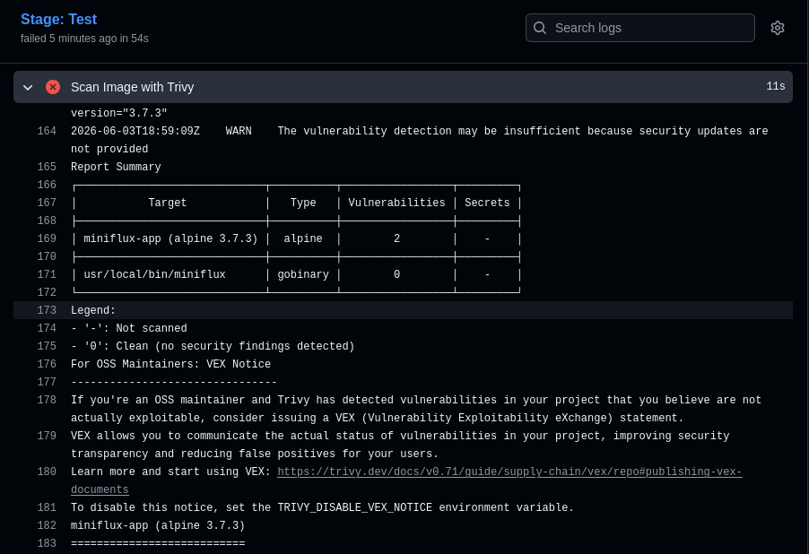
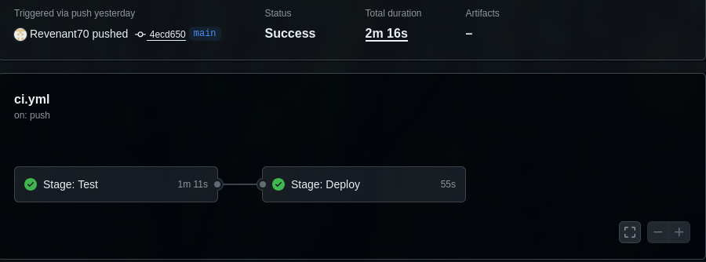
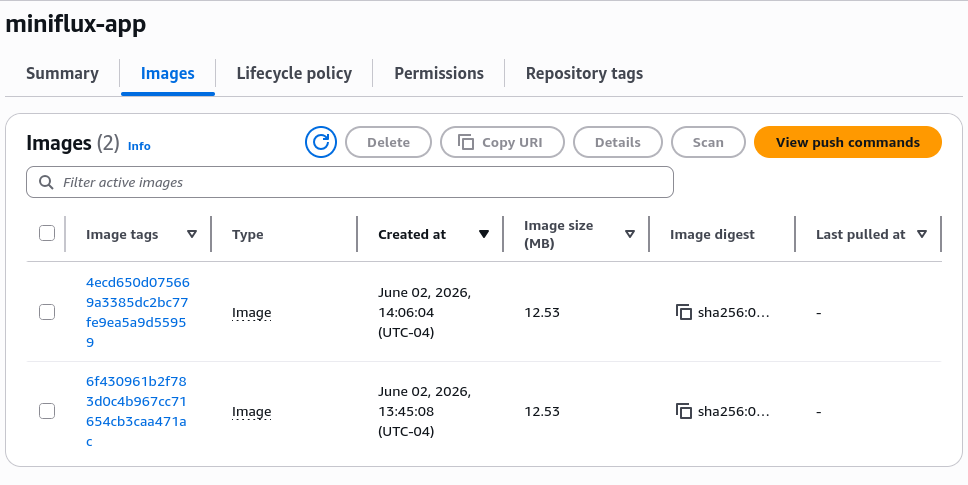

# Project 1 — Secure CI/CD Pipeline

## Projects

- [Project 1 — Secure CI/CD Pipeline](https://github.com/Revenant70/Minifluxv2) ← you are here
- Project 2 — Self-Healing Kubernetes Cluster _(coming soon)_
- Project 3 — One-Click AWS Environment _(coming soon)_

## What This Is

A production-style CI/CD pipeline built around a real application. The goal is simple — a pipeline that doesn't just build and deploy, but actively blocks bad code from merging. Security is the idea here.

## Stack

- **Containerization:** Docker
- **CI/CD:** GitHub Actions
- **Image Scanning:** Trivy
- **Image Hosting:** AWS ECR
- **Source App:** [Minifluxv2](https://github.com/fadelpamungkas/minifluxv2) — forked and built upon at [My Fork](https://github.com/Revenant70/Minifluxv2)

## How It Works

- Checkout
- Build image
- Trivy scans the built image
- High severity findings → pipeline fails, merge blocked
- Everything clean → push image to ECR, merge to main allowed

## Architecture Decisions

| Decision                | Choice                                 | Why                                                                                                                                                                                                      |
| ----------------------- | -------------------------------------- | -------------------------------------------------------------------------------------------------------------------------------------------------------------------------------------------------------- |
| IAM Access Keys         | ID and secret pair over OIDC           | Faster to get working while learning the stack. OIDC is the right long term move and will be swapped in during Project 3                                                                                 |
| Multi-stage Dockerfile  | Two stages over one                    | Stage 1 builds the Go binary. Stage 2 copies only that binary into a clean Alpine image and throws everything else away. Fewer packages in the final image means fewer CVEs and faster container startup |
| Non-Root Container User | Non-root over root                     | If someone gets into the container they can only do what the app user can do — nothing else. Also plays nicely with hardened Kubernetes clusters in Project 2                                            |
| Image Tagging           | Commit SHA over latest                 | Every image in ECR ties back to the exact commit that built it. Makes debugging production issues a lot less painful                                                                                     |
| Branch Protection       | PRs required, no direct pushes to main | Nothing gets to main without passing the pipeline first. Enforced at the repo level, not just by convention                                                                                              |

## Steps I Took

1. Built a custom multi-stage Dockerfile for Miniflux from scratch
2. Verified the image built and ran correctly locally
3. Wrote the GitHub Actions pipeline — test stage first, deploy stage second
4. Set up AWS ECR and an IAM user so the pipeline had permission to push images
5. Locked down main with branch protection rules

## What Broke

| Date       | What Happened                                                                                                                                                                              | What I Learned                                                                     |
| ---------- | ------------------------------------------------------------------------------------------------------------------------------------------------------------------------------------------ | ---------------------------------------------------------------------------------- |
| 05/23/2026 | Pushed directly to main before branch protection was set up                                                                                                                                | Set up branch protection first, not after the pipeline is already built            |
| 06/01/2026 | Started with Gitea — Trivy found a bunch of CRITICAL and HIGH CVEs in Gitea's own code that I couldn't patch myself. Pipeline blocked the build, which is exactly what it should have done | Image selection is a security decision. Switched to Miniflux which came back clean |

## What's Next

- Swap IAM access keys for OIDC in Project 3
- Add Checkov scanning against Terraform in Project 3
- Enforce non-root containers at the Kubernetes level in Project 2
